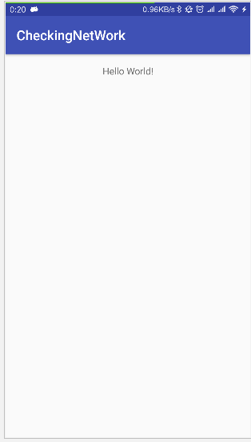
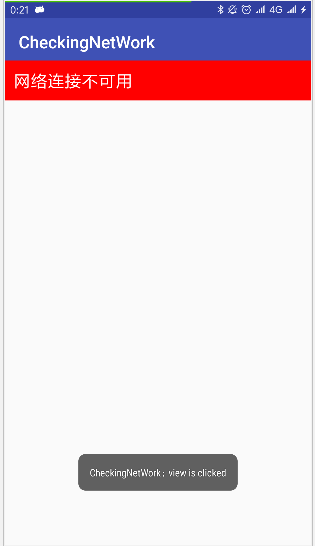

####仿微信实时提示用户当前网络状态
动态注册广播
增加了ping功能
支持自定义UI及添加点击事件
####使用方法
```
    //在BaseActivity中
    private NetworkChangeObserver observer;


    @Override
    protected void onCreate(Bundle savedInstanceState)
    {
        super.onCreate(savedInstanceState);
        setContentView(R.layout.activity_main);
        observer = new NetworkChangeObserver();
        ConfigBuilder configBuilder = ConfigBuilder.getInstance();
        //自定义配置，详见demo
        configBuilder
                .setLayoutResId(R.layout.layout_network_tip)
                .setMarginTop(50)
                .setClickListener(this);
        //注册
        observer.register(this);

    }


    @Override
    protected void onDestroy()
    {
        super.onDestroy();
        //解除
        observer.unRegister(this);
    }
    
```
####截图

